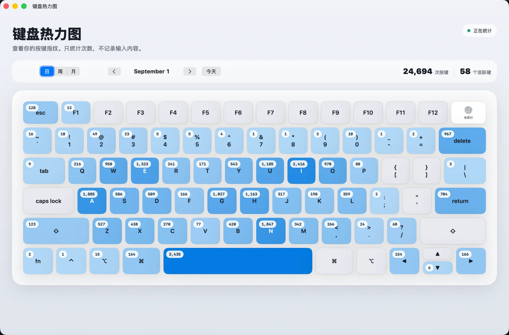

# KeyHeat

KeyHeat 是一个 macOS 键盘热力图工具：只统计物理按键次数，不记录输入内容。



## 适合谁

适合想了解自己键盘使用习惯、但不希望记录具体输入内容的人。KeyHeat 只展示按键频率和热度，不提供输入内容回放或应用级追踪。

## 功能

- 按日、周、月查看键盘使用情况
- 以键盘布局展示按键热度和次数
- 支持隐藏菜单栏图标，隐藏后后台统计仍会继续
- 可选登录后自动启动
- 数据仅保存在本机

## 使用方式

打开应用后，主窗口会显示当前统计周期。可以切换日、周、月视图，并使用左右按钮浏览历史周期。菜单栏图标可以快速打开主窗口或设置。

如果不想占用菜单栏空间，在设置中关闭“在菜单栏显示图标”即可；这只隐藏图标，不会停止后台统计。之后重新打开 KeyHeat 可恢复图标。

## 隐私

KeyHeat 只读取按键的物理键位和累计次数，不保存字符、输入顺序、应用名称或具体时间点。统计数据存放在：

`~/Library/Application Support/KeyHeat/KeyHeat.store`

## 权限

首次运行需要在“系统设置 → 隐私与安全性 → 输入监控”中允许 KeyHeat。该权限用于接收键盘事件并进行本地计数，不会记录输入文本。

如果授权后状态仍未更新，可点击“重新检测”，或退出并重新打开 KeyHeat。权限变更由 macOS 系统设置控制，KeyHeat 不会代替用户修改系统权限。

## 运行

1. 使用 Xcode 打开 `KeyHeat.xcodeproj`。
2. 选择 `KeyHeat` scheme 和当前 Mac。
3. 点击 Run。
4. 按提示授予输入监控权限。

## 构建

```bash
xcodebuild \
  -project KeyHeat.xcodeproj \
  -scheme KeyHeat \
  -configuration Release \
  -derivedDataPath .build \
  CODE_SIGNING_ALLOWED=NO \
  build
```

## 技术栈

- SwiftUI / AppKit
- SwiftData
- Core Graphics event tap
- macOS 13+

## 项目结构

- `KeyHeat/`：应用源码
- `KeyHeatTests/`：单元测试
- `KeyHeat.xcodeproj/`：Xcode 工程配置
- `docs/preview.webp`：README 预览图

## 许可

当前项目尚未指定开源许可证。若要允许他人明确地使用、修改和分发，请补充 `LICENSE` 文件。
